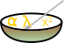

# MathBran
is a specification for serializing typeset mathematical constructs.

For the most part MathBran uses standard unicode, but three symbols are overloaded to allow for typeset constructs. These are:
* ⁜ - Construct symbol
* ⏴- Open argument symbol
* ⏵- Close argument symbol

It is permissible to escape the special symbols, for example the string `x = 3 ⁜ 2` has a MathBran representation `x = 3 ⁜⁜ 2`. Hopefully the obscurity of the symbols will prevent escaped characters from occurring often.

The construct symbol indicates the start of specially formatted text. The next character after the construct symbol is the construct code. For example, the LaTeX-style equation `i = \sqrt{-1}` has a MathBran representation: `i = ⁜√⏴-1⏵`. Constructs can nest arbitrarily deep, e.g. MathBran uses `\cos(π/4) = ⁜f⏴⁜√⏴2⏵⏵⏴2⏵` to represent the LaTeX equation `cos(\pi/4) = \frac{\sqrt{2}}{2}`.

Not every argument will be parsed as text. Some arguments contain information about the Construct being parsed. For example, to specify a matrix unambiguously, MathBran requires the first argument to specify the column count. The MATLAB-style matrix `[A B C; D E F]` has a MathBran representation `⁜⊞3⏴A⏵⏴B⏵⏴C⏵⏴D⏵⏴E⏵⏴F⏵`.

The construct codes and their usage are specified in the table below:

Symbol|Description|Usage
------|-----------|-----
⁜|Construct Symbol|⁜⁜
⏴|Open|⁜⏴
⏵|Close|⁜⏵
→|Accent Arrow|⁜→⏴Text⏵
ā|Accent Bar|⁜ā⏴Text⏵
ă|Accent Breve|⁜ă⏴Text⏵
ȧ|Accent Dot|⁜ȧ⏴Text⏵
ä|Accent Double Dots|⁜ä⏴Text⏵
⋯|Accent Triple Dots|⁜⋯⏴Text⏵
â|Accent Hat|⁜â⏴Text⏵
ã|Accent Tilde|⁜ã⏴Text⏵
∑|Summation|⁜∑(⏴Underscript⏵(⏴Overscript⏵)?)?
∏|Product|⁜∏(⏴Underscript⏵(⏴Overscript⏵)?)?
∐|Coproduct|⁜∐(⏴Underscript⏵(⏴Overscript⏵)?)?
⋂|Intersection|⁜⋂(⏴Underscript⏵(⏴Overscript⏵)?)?
⋃|Union|⁜⋃(⏴Underscript⏵(⏴Overscript⏵)?)?
⨄|Union Plus|⁜⨄(⏴Underscript⏵(⏴Overscript⏵)?)?
b|Binomial Coefficients|⁜b⏴Top⏵⏴Bottom⏵
c|Cases|⁜c(⏴Value⏵⏴Condition⏵)+
f|Fraction|⁜f⏴Numerator⏵⏴Denominator⏵
(|Grouping Parenthesis|⁜(⏴Text⏵
[|Grouping Brackets|⁜[⏴Text⏵
{|Grouping Braces|⁜{⏴Text⏵
⟨|Grouping Angles|⁜⟨⏴Text⏵
⌈|Grouping Ceil|⁜⌈⏴Text⏵
⌊|Grouping Floor|⁜⌊⏴Text⏵
⟪|Grouping Double Angles|⁜⟪⏴Text⏵
|Grouping Double Brackets|⁜⏴Text⏵
\||Grouping Bars|⁜\|⏴Text⏵
‖|Grouping Double Bars|⁜‖⏴Text⏵
∫|Integral|⁜∫(⏴Subscript⏵(⏴Superscript⏵)?)?
∬|Double Integral|⁜∬(⏴Subscript⏵)?
∭|Triple Integral|⁜∭(⏴Subscript⏵)?
∮|Convolution Integral|⁜∮(⏴Subscript⏵(⏴Superscript⏵)?)?
∯|Double Convolution Integral|⁜∯(⏴Subscript⏵)?
∰|Triple Convolution Integral|⁜∰(⏴Subscript⏵)?
⊞|Matrix|⁜⊞⏴r⏵⏴c⏵(⏴Entry⏵)\<r×c\>   r,c ∈ 1, 255
√|Root|⁜√⏴Body⏵(⏴Script⏵)?
_|Subscript|⁜_⏴Subscript⏵
^|Superscript|⁜^⏴Superscript⏵
Δ|Dualscript|⁜Δ⏴Subscript⏵⏴Superscript⏵
┊|Evalscript|⁜┊⏴Subscript⏵⏴Superscript⏵
l|Limit|⁜l⏴Text⏵⏴Approaching⏵
↑|Underscripted max|⁜↑⏴Underscript⏵
↓|Underscripted min|⁜↓⏴Underscript⏵
↗|Underscripted sup|⁜↗⏴Underscript⏵
↘|Underscripted inf|⁜↘⏴Underscript⏵
